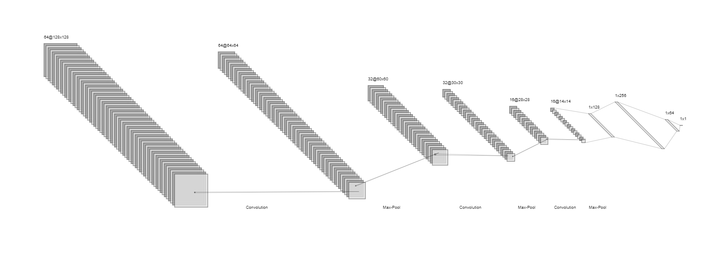
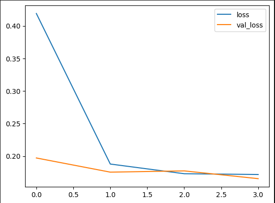
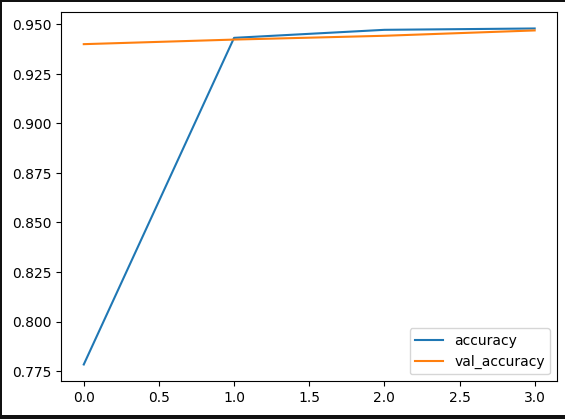
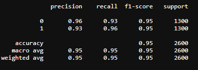

# Deep Neural Network for Malaria Infected Cell Recognition

## AIM

To develop a deep neural network for Malaria infected cell recognition and to analyze the performance.

## Problem Statement and Dataset

Aims to create an algorithm that can detect malaria-infected cells in blood samples using deep learning techniques. The goal is to develop a model that can accurately identify infected cells and distinguish them from healthy ones. The performance of the model will be evaluated based on its accuracy, precision, recall, and F1 score. This problem statement is important because it can help improve the diagnosis of malaria and reduce the time and cost associated with manual diagnosis.

Malaria dataset of 27,558 cell images with an equal number of parasitized and uninfected cells. A level-set based algorithm was applied to detect and segment the red blood cells. The images were collected and annotated by medical professionals.Here we build a convolutional neural network model that is able to classify the cells.

## Neural Network Model

## DESIGN STEPS

### STEP-1:
Import tensorflow and preprocessing libraries

### STEP 2:
Download and load the dataset folder

### STEP-3:
Split the training and testing folders.

### STEP 4:
Perform image data generation methods.

### STEP-5:
Build the convolutional neural network model

### STEP-6:
Train the model with the training data

### STEP-7:
Plot the performance plot

### STEP-8:
Evaluate the model with the testing data using probability prediction(uninfected-> prob>0.5,parasitized-> <=0.5)

### STEP-9:
Fit the model and predict the sample input.
Write your own steps

## PROGRAM

~~~
import os
import pandas as pd
import numpy as np
import seaborn as sns
import matplotlib.pyplot as plt
from matplotlib.image import imread
from tensorflow.keras.preprocessing.image import ImageDataGenerator
from tensorflow import keras
from tensorflow.keras import layers
from tensorflow.keras import utils
from tensorflow.keras import models
from sklearn.metrics import classification_report,confusion_matrix
import tensorflow as tf
# to share the GPU resources for multiple sessions
from tensorflow.compat.v1.keras.backend import set_session
config = tf.compat.v1.ConfigProto()
config.gpu_options.allow_growth = True # dynamically grow the memory used on the GPU
config.log_device_placement = True # to log device placement (on which device the operation ran)
sess = tf.compat.v1.Session(config=config)
set_session(sess)

%matplotlib inline

my_data_dir = 'dataset/cell_images'

os.listdir(my_data_dir)

test_path = my_data_dir+'/test/'
train_path = my_data_dir+'/train/'

os.listdir(train_path)

len(os.listdir(train_path+'/uninfected/'))

len(os.listdir(train_path+'/parasitized/'))

os.listdir(train_path+'/parasitized')[560]

para_img= imread(train_path+
                 '/parasitized/'+
                 os.listdir(train_path+'/parasitized')[560])
                
plt.imshow(para_img)

uninfe_img= imread(train_path+
                 '/uninfected/'+
                 os.listdir(train_path+'/uninfected')[560])
                
plt.imshow(uninfe_img)

# Checking the image dimensions
dim1 = []
dim2 = []
for image_filename in os.listdir(test_path+'/uninfected'):
    img = imread(test_path+'/uninfected'+'/'+image_filename)
    d1,d2,colors = img.shape
    dim1.append(d1)
    dim2.append(d2)

sns.jointplot(x=dim1,y=dim2)

image_shape = (130,130,3)

model = models.Sequential()

model.add(layers.Conv2D(filters=64, kernel_size=(3,3),input_shape=image_shape, activation='relu',))
model.add(layers.MaxPooling2D(pool_size=(2, 2)))

model.add(layers.Conv2D(filters=32, kernel_size=(5,5), activation='relu',))
model.add(layers.MaxPooling2D(pool_size=(2, 2)))

model.add(layers.Conv2D(filters=16, kernel_size=(3,3), activation='relu',))
model.add(layers.MaxPooling2D(pool_size=(2, 2)))

model.add(layers.Flatten())

model.add(layers.Dense(128))
model.add(layers.Activation('relu'))
model.add(layers.Dropout(0.5))

model.add(layers.Dense(256))
model.add(layers.Activation('relu'))

model.add(layers.Dense(64))
model.add(layers.Activation('relu'))

model.add(layers.Dense(1))
model.add(layers.Activation('sigmoid'))

model.compile(loss='binary_crossentropy',
              optimizer='adam',
              metrics=['accuracy'])

model.summary()

image_gen = ImageDataGenerator(rotation_range=40, # rotate the image 20 degrees
                               width_shift_range=0.10, # Shift the pic width by a max of 5%
                               height_shift_range=0.10, # Shift the pic height by a max of 5%
                               rescale=1/255, # Rescale the image by normalzing it.
                               shear_range=0.1, # Shear means cutting away part of the image (max 10%)
                               zoom_range=0.1, # Zoom in by 10% max
                               horizontal_flip=True, # Allo horizontal flipping
                               fill_mode='nearest' # Fill in missing pixels with the nearest filled value
                              )
batch_size = 16

train_image_gen = image_gen.flow_from_directory(train_path,
                                               target_size=image_shape[:2],
                                                color_mode='rgb',
                                               batch_size=batch_size,
                                               class_mode='binary')

len(train_image_gen.classes)

test_image_gen = image_gen.flow_from_directory(test_path,
                                               target_size=image_shape[:2],
                                               color_mode='rgb',
                                               batch_size=batch_size,
                                               class_mode='binary',shuffle=False)
            
train_image_gen.class_indices

results = model.fit(train_image_gen,epochs=4,
                              validation_data=test_image_gen
                             )

plot = pd.DataFrame(model.history.history)

plot.head

plot[['loss','val_loss']].plot()

plot[['accuracy','val_accuracy']].plot()

model.evaluate(test_image_gen)

pred_probabilities = model.predict(test_image_gen)

test_image_gen.classes

predictions = pred_probabilities > 0.5

print(classification_report(test_image_gen.classes,predictions))

confusion_matrix(test_image_gen.classes,predictions)

import random
import tensorflow as tf
list_dir=["uninfected","parasitized"]
dir_=(random.choice(list_dir))
para_img= imread(train_path+
                 '/'+dir_+'/'+
                 os.listdir(train_path+'/'+dir_)[random.randint(0,100)])
img  = tf.convert_to_tensor(np.asarray(para_img))
img = tf.image.resize(img,(130,130))
img=img.numpy()
pred=bool(model.predict(img.reshape(1,130,130,3))<0.5 )
plt.title("Model prediction: "+("Parasitized" if pred  else "Uninfected")+"\nActual Value: "+str(dir_))
plt.axis("off")
plt.imshow(img)
plt.show()

import random
import tensorflow as tf
# list_dir=["uninfected","parasitized"]
# dir_=(random.choice(list_dir))
# para_img= imread(train_path+
#                  '/'+dir_+'/'+
#                  os.listdir(train_path+'/'+dir_)[random.randint(0,100)])
para_img = imread('Rajeshkannan- uninfected.png')
plt.imshow(para_img)

~~~

## OUTPUT

### Training Loss, Validation Loss Vs Iteration Plot

### Validation Accuracy Vs Accuracy Iteration Plot

### Classification Report

### Confusion Matrix

### New Sample Data Prediction

## RESULT

Thus, a deep neural network for Malaria infected cell recognition is developed and the performance is analyzed.

